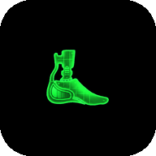
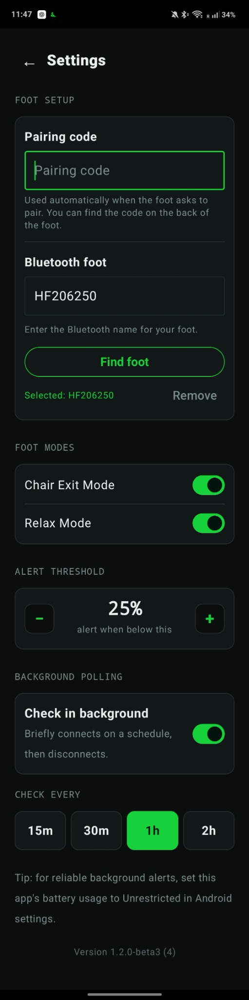
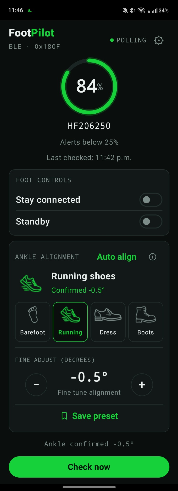
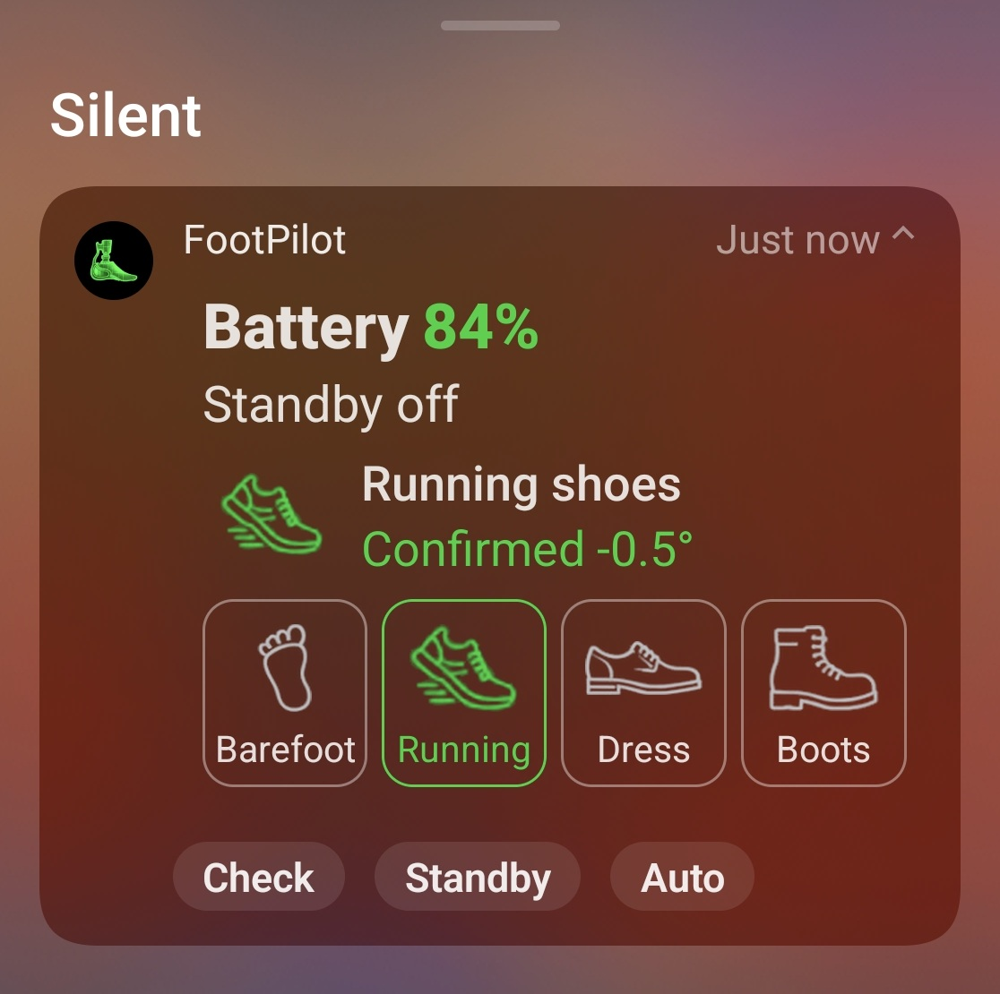

  
  <h1>FootPilot</h1>
  
A simple Android companion for checking and controlling a compatible Össur PROPRIO FOOT.

  
<strong>Battery alerts&nbsp;&nbsp;·&nbsp;&nbsp;Standby control&nbsp;&nbsp;·&nbsp;&nbsp;Ankle alignment&nbsp;&nbsp;·&nbsp;&nbsp;Footwear presets</strong>

> [!IMPORTANT]
> FootPilot is currently a beta. Ankle movement should always be tested while seated and safely supported. Follow the instructions from your prosthetist and the device manufacturer.

## What FootPilot does

FootPilot gives you one place to:

- Check the foot's battery level and receive a low-battery alert.
- Keep a live Bluetooth connection when you want faster controls.
- Turn Standby on or off.
- Use Chair Exit Mode and Relax Mode.
- Automatically align the ankle for a different heel height.
- Fine-tune the ankle in 0.1° steps.
- Save and recall Barefoot, Running, Dress, and Boots presets.
- Control commonly used features from the Android notification.

FootPilot communicates directly with the selected foot over Bluetooth. The app does not request internet access.

## Install the app

FootPilot requires an Android phone running Android 8.0 or newer with Bluetooth Low Energy.

1. Download the FootPilot APK supplied by the project owner. Published builds will appear on the [Releases page](https://github.com/onomic/FootBattery/releases).
2. Open the APK on your phone.
3. If Android blocks the installation, allow **Install unknown apps** for the browser or file manager you used, then try again.
4. Open FootPilot and allow its Bluetooth, nearby-device, and notification permissions.

Only install APKs obtained from this repository or directly from the project owner.

## Set up your foot

Before starting, turn on Bluetooth and close any other app connected to the foot. The foot can accept only one app connection at a time.

1. Open FootPilot and tap the **gear** in the upper-right corner.
2. Enter the **pairing code** printed on the back of the foot.
3. Enter the foot's exact Bluetooth name, such as `HF206250`.
4. Tap **Find foot**.
5. Wait until the selected foot is shown in green.
6. Return to the main screen and tap **Check now**.

FootPilot scans only for the exact name you enter and verifies that the selected device is compatible before saving it.

 

## Everyday use

### Battery and Check now

The large ring shows the latest battery reading. **Last checked** is the time of the most recent complete verified check.

Tap **Check now** whenever you want a fresh battery and Standby status. The ankle position is also checked when Standby is confirmed off. FootPilot connects, checks the foot, updates the screen, and disconnects when a live connection is not being used.

### Stay connected

Turn on **Stay connected** when you want a continuous Bluetooth connection and smoother, faster adjustments. It also keeps the ongoing FootPilot notification available. Turn it off when you no longer need a live session.

### Standby

The **Standby** switch shows the state confirmed by the foot. A fresh check may be required before the switch becomes available. Ankle movement is disabled while Standby is on or its state cannot be verified.

### Status at the top

- **CONNECTED** means Stay connected is active and the foot is ready.
- **CONNECTING** or **DISCONNECTING** means the live session is changing state.
- **POLLING** means scheduled background checks are enabled.
- **IDLE** means there is no live connection or scheduled check running.

 

## Choose the right connection option

| Option | Best for | How it works |
|---|---|---|
| **Check now** | A quick update | Connects for one verified check, then disconnects. |
| **Stay connected** | Ankle adjustments and frequent controls | Keeps one live connection open while FootPilot is running. |
| **Check in background** | Automatic battery alerts | Briefly connects on a schedule, checks the foot, then disconnects. |

Stay connected and background checking are separate options. You can use either one without enabling the other.

## Ankle alignment

> [!CAUTION]
> Sit down and make sure you are safely supported before moving the ankle. Never adjust it while standing, walking, or driving.

Ankle controls become available only after FootPilot confirms that Standby is off and verifies the current ankle position.

### Auto align

1. Sit down and place the whole foot flat on the floor, from heel to toe.
2. Tap **Auto align**.
3. Keep the foot flat until the second beep.
4. Lift the foot so the ankle can finish adapting.
5. Wait for FootPilot to verify and display the confirmed angle.

### Fine adjust

Use the **−** and **+** buttons to move the ankle by exactly 0.1° at a time. The confirmed angle shown on screen comes from the foot after the adjustment.

### Save a footwear preset

FootPilot includes four fixed presets: **Barefoot**, **Running**, **Dress**, and **Boots**.

1. Tap the footwear preset you want to configure.
2. Use **Auto align** or **Fine adjust** to reach the comfortable position.
3. Wait for the angle to be confirmed.
4. Tap **Save preset**.

To use it later, tap the configured preset. A preset with no saved angle selects the slot but does not move the ankle.

## Chair Exit Mode and Relax Mode

Open **Settings** to find both foot modes. FootPilot checks their current states when the Settings screen opens.

- Use each switch to request the mode's on or off state.
- Wait for the operation to finish before changing another control.
- Use these modes only as instructed by your prosthetist or the device documentation.

## Battery alerts and background checks

In **Settings**, you can choose when and how often FootPilot checks the battery:

- Set the alert threshold from **5% to 50%** in 5% steps.
- Turn on **Check in background**.
- Choose **15 minutes**, **30 minutes**, **1 hour**, or **2 hours**.

FootPilot alerts once when the battery drops below your chosen threshold. The alert automatically becomes ready again after the foot is charged above the threshold.

For reliable background alerts, open Android's app settings for FootPilot and set battery usage to **Unrestricted** or **Don't optimize**. The exact wording varies by phone manufacturer.

## Notification controls

When Stay connected or background checking is active, FootPilot shows an ongoing notification with the latest battery and foot status. Expand it to access available controls:

- Saved footwear presets
- **Check**
- **Standby**
- **Auto**

Controls appear only when FootPilot can safely verify the required device state. During automatic alignment, the notification also reminds you when to keep the foot flat and when to lift it.

  
   
  Expanded FootPilot notification on Samsung One UI.

## Troubleshooting

### FootPilot cannot find the foot

- Confirm that Bluetooth is on.
- Enter the exact Bluetooth name shown by the foot.
- Close the Össur app or any other app that may already be connected.
- Keep the foot awake, charged, and close to the phone.
- Confirm that FootPilot has Bluetooth and nearby-device permission.

### Pairing fails

- Re-enter the numeric pairing code from the back of the foot.
- Remove the selected foot in Settings, then use **Find foot** again.

### A control is unavailable

- Tap **Check now** and wait for a verified result.
- Make sure Standby is off before using ankle controls.
- Wait for any current connection or adjustment to finish.
- Turn on **Stay connected** if you are making several adjustments.

### Background alerts do not arrive

- Allow notifications for FootPilot.
- Confirm that **Check in background** is on.
- Set FootPilot's Android battery usage to **Unrestricted** or **Don't optimize**.
- Make sure Bluetooth remains enabled.

## Safety and project status

FootPilot is an independent, experimental companion app and is not a replacement for professional fitting, the manufacturer's instructions, or the manufacturer's official software. Physical movement has not been validated by automated software tests. Use ankle and mode controls only when seated, safely supported, and able to stop immediately if the foot behaves unexpectedly.

Current beta build: **1.2.0-beta3**
